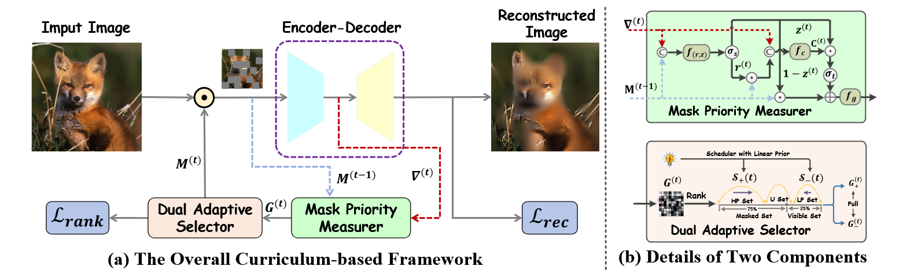
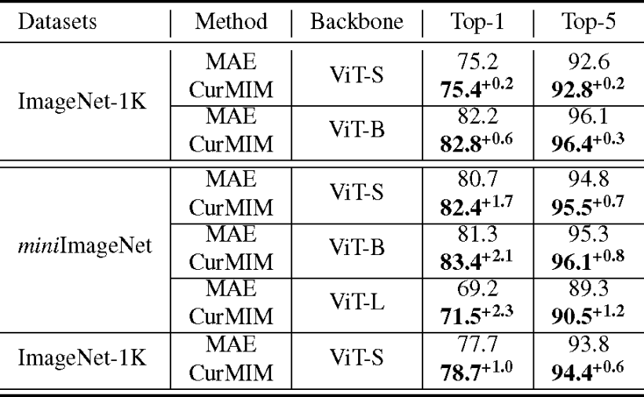

# CurMIM: Curriculum Masked Image Modeling (ICASSP 2025)

> ICASSP 2025 paper on curriculum-based masked image modeling for self-supervised visual representation learning.

## Authors

**Hao Liu**<sup>1</sup>, **Kun Wang**<sup>1</sup>, **Yudong Han**<sup>1</sup>, **Haocong Wang**<sup>1</sup>, **Yupeng Hu**<sup>1</sup>, **Chunxiao Wang**<sup>2</sup>, **Liqiang Nie**<sup>3</sup>

<sup>1</sup> School of Software, Shandong University, Jinan, China  
<sup>2</sup> Key Laboratory of Computing Power Network and Information Security, Ministry of Education, Qilu University of Technology (Shandong Academy of Sciences), Jinan, China  
<sup>3</sup> School of Computer Science and Technology, Harbin Institute of Technology, Shenzhen, China

## Links

- **Paper (IEEE Xplore)**: [CurMIM: Curriculum Masked Image Modeling](https://ieeexplore.ieee.org/document/10890877)

---

## Table of Contents

- [Updates](#updates)
- [Introduction](#introduction)
- [Highlights](#highlights)
- [Method Overview](#method-overview)
- [Project Structure](#project-structure)
- [Installation](#installation)
- [Checkpoints](#checkpoints)
- [Dataset](#dataset)
- [Usage](#usage)
- [Results](#results)
- [Citation](#citation)
- [Acknowledgement](#acknowledgement)
- [License](#license)
- [Contact](#contact)
---

## Updates

- [04/2026] Initial public code release.

---

## Introduction

This repository contains the implementation of **CurMIM: Curriculum Masked Image Modeling** (ICASSP 2025).

Masked Image Modeling (MIM) usually applies a fixed masking strategy during pretraining. CurMIM introduces a curriculum-style strategy to progressively adjust masking behavior, helping the model learn from easier to harder reconstruction targets and improving representation quality.

This repository currently provides:

- pretraining code
- finetuning / linear probing code
- training utilities and distributed training scripts

---

## Highlights

- Curriculum-based masking for MIM pretraining
- MAE-style pretraining + ViT finetuning workflow
- Support for pretrain, finetune, and linear probe pipelines

---

## Method Overview



---

## Project Structure

```text
.
|-- asset/                     # framework figure and visual assets
|-- util/                      # data, optimization, lr schedule, misc utils
|-- convGRU.py                 # ConvGRU module used in masking dynamics
|-- models_mae.py              # MAE backbone and pretraining model
|-- models_vit.py              # ViT classification model
|-- vision_transformer.py      # transformer utilities
|-- engine_pretrain.py         # pretraining loop
|-- engine_finetune.py         # finetuning/evaluation loop
|-- main_pretrain.py           # entry for MIM pretraining
|-- main_finetune.py           # entry for finetuning
|-- main_linprobe.py           # entry for linear probing
|-- submitit_pretrain.py       # distributed launcher (submitit)
|-- submitit_finetune.py       # distributed launcher (submitit)
|-- submitit_linprobe.py       # distributed launcher (submitit)
|-- README.md
```

---

## Installation

### 1. Clone the repository

```bash
git clone https://github.com/iLearn-Lab/CurMIM.git
cd CurMIM
```

### 2. Create environment

```bash
python -m venv .venv
source .venv/bin/activate   # Linux / Mac
# .venv\Scripts\activate    # Windows
```

### 3. Install dependencies

```bash
pip install torch torchvision timm==0.3.2 tensorboard
```


---

## Checkpoints

The cloud links of checkpoints: [Google Drive](https://drive.google.com/drive/folders/1KyrNyLmsjkM5J4wAFLD386F8C4pgx2x2?usp=sharing).

---

## Dataset

Follow [MAE](https://github.com/facebookresearch/mae) 's dataset preparation for [ImageNet](https://www.image-net.org/).

---

## Usage

### Pretraining

```bash
python -m torch.distributed.launch --nproc_per_node {GPU_number}  ./main_pretrain.py --batch_size 128 \
--accum_iter 2 \
--model {model_type} \
--mask_ratio 0.75 --epochs 300 --warmup_epochs 40 \
--blr 4e-4 --weight_decay 0.05 \
--data_path ../path --output_dir ./output_dir/
```

### Finetuning

```bash
!python -m torch.distributed.launch --nproc_per_node={GPU_number} ./main_finetune.py \
    --batch_size 128 \
    --nb_classes {nb_classes} \
    --model {model_type} \
    --finetune ./checkpoint.pth \
    --epochs 100 \
    --blr 1e-3 --layer_decay 0.65 --output_dir ./finetune \
    --weight_decay 0.05 --drop_path 0.1 --mixup 0.8 --cutmix 1.0 --reprob 0.25 \
    --dist_eval --data_path ../data/
```

---

## Results

Fine-tuning performance for models pre-trained on ImageNet-1K (top) and miniImageNet (bottom).



---

## Citation

```bibtex
@inproceedings{liu2025curmim,
  title={CurMIM: Curriculum Masked Image Modeling},
  author={Liu, Hao and Wang, Kun and Han, Yudong and Wang, Haocong and Hu, Yupeng and Wang, Chunxiao and Nie, Liqiang},
  booktitle={2025 IEEE International Conference on Acoustics, Speech and Signal Processing (ICASSP)},
  pages={1--5},
  year={2025},
  doi={10.1109/ICASSP49660.2025.10890877}
}
```

---

## Acknowledgement

- Thanks to the [MAE](https://github.com/facebookresearch/mae) and [ViT](https://github.com/google-research/vision_transformer) open-source community for strong baselines and tooling.
- Thanks to all collaborators and contributors of this project.

---

## License

This project is released under the Apache License 2.0.

---

# Contact
**If you have any questions, feel free to contact me at liuh90210@gmail.com**.
